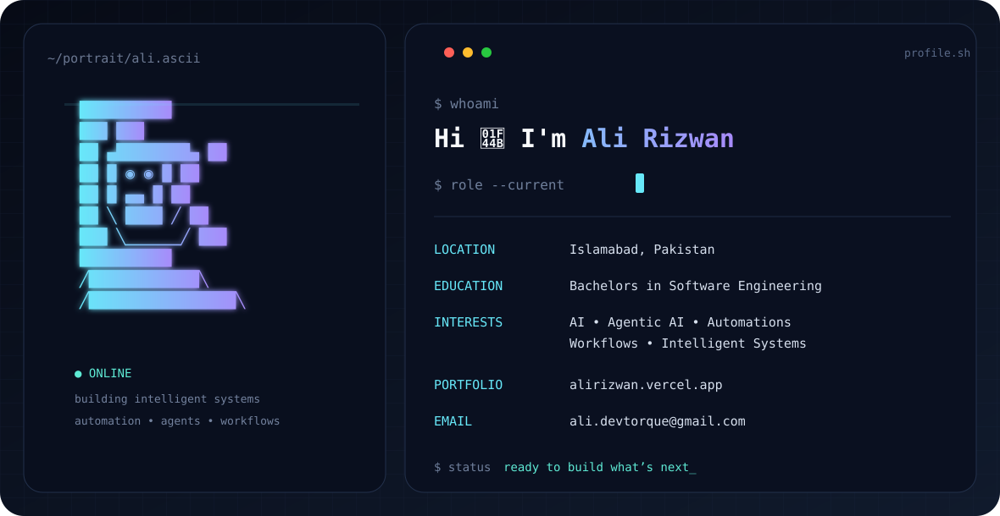

<div align="center">



<br/>

### AI Engineer • Agentic AI • Automations • Workflows

Building intelligent systems and practical AI products from Islamabad, Pakistan.

[](https://alirizwan.vercel.app)
[](mailto:ali.devtorque@gmail.com)
[](https://github.com/AR18now)

</div>

---

### `> about_me`

```yaml
name: Ali Rizwan
location: Islamabad, Pakistan
education: Bachelors in Software Engineering
focus:
  - Artificial Intelligence
  - Agentic AI
  - AI Automations
  - Workflows
  - Intelligent Systems
```

### `> current_focus`

- 🤖 Building with **AI agents, LLMs and intelligent workflows**
- ⚡ Exploring **automation systems and agentic AI architectures**
- 🧠 Turning ideas into **practical AI-powered products**
- 🚀 Interested in collaborating on **AI, automation and software engineering projects**

### `> tech_stack`

<p align="center">

</p>

### `> github_stats`

<div align="center">


</div>

---

<div align="center">
<sub>Always learning. Always building.</sub>
</div>
